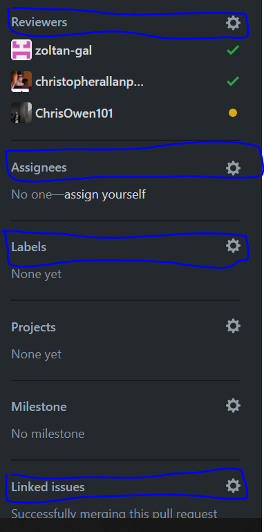
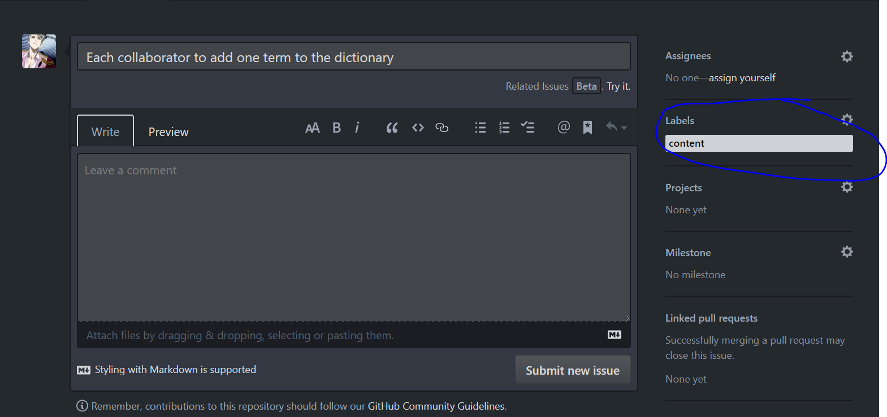

# Welcome to the CYF Manchester Dictionary Project!

## The aim of the project

During the course, you will be learning to use Git. Especially at the beginning, it can be hard to understand the process. You will get lots of opportunities to use your new Git skills on the course, but this project will provide extra, optional practice.

The other aim of this project is to create a resource that is made for the students, by the students (that's you!). If this project is successful, we will make it available to other students studying with CodeYourFuture and you'll be famous forever :D

## What is the project?

During the course, you will learn lots of new and sometimes complicated words. We would encourage you to make notes and revise so that you can find a way to make things make sense to you.

It is hoped through this project that we will create a dictionary that can be accessed and updated. At first, this will be a very basic list. As you review HTML and CSS, and then learn how to properly implement Javascript, we will make the site more and more complicated!

## Rules

The way you work with others through GitHub will differ from place to place, but here's the rules we will use.

- We will have two branches. One will be `master`, which will hold our most stable version. The other will be `develop` which will be our working, in-progress version. When you make your pull request to the repo, do it to the `develop` branch and not the `master` branch.
- Fork from the `cyf-manchester-dictionary' so you have your own repo to push to. You should make changes locally on your machine, push to YOUR forked version of the original repo, then do a pull request to the original repo to get your changes approved (see the next section, 'guide to collaborating' for detailed steps).
- The rule I'm putting in place to try and get some agreement with changes is that the pull request needs to be reviewed and approved by at least three people before the change is merged. If you have any objections, be sure to let the person know why and offer your opinion, thoughts and feedback.

## Guide to collaborating

1. Fork 'cyf-manchester-dictionary'
   . You'll be asked where you want to fork the repo to. You'll most likely just have one option, your repo. Click that and let the fork process. Then go to your profile and open the repo that was just created.
2. Make changes within your local repo. This will just be working with Git as you would with your own project, that being: you set the remote branch, use `git add`, `git commit -m 'message'` and `git push` to send your changes to the repo.
3. Make a pull request from your repo
   
4. Here's an example of what you will see when you open the pull request. Your repo will be on the right, and the one you are requesting to push to on the left
   
   Make sure the base is 'develop' so that you push to the develop branch.
5. Once you make your pull request, you will see a menu to the right that looks like this. I have circled in blue the most relevant areas.

   

   - Reviewers: the people who are reviewing your pull request. You can request certain people or groups to look at the pull request, or people can assign themselves if they want to review the pull request.
     -Assignees: linked to 'issues' which are basically tasks or problems that need to be dealt with on the project. If you are the 'assignee', you're the person working on the project. For pull requests, you don't need to worry too much about this section.
   - Labels: we will use labels to try and track what kind of work is being done. If you click the cog symbol, you will see a list of possible labels to use. Be sure to try and do this to keep things organized. Labels can be added, removed and changed at any time.
   - Linked issues: if an 'issue' is open, it will remain open until closed manually by somebody or until a change is made that resolves the issue. If you link an issue, once your code is accepted and merged, the issue will automatically close. See more about 'issues' in the next section.

6. Once the pull request has been reviewed and approved by at least three people, you can click the button at the bottom that is labelled with merge. When you click this, your code is added to the original project. Congratulations!

## What are issues on GitHub?

In a project, there may be many things that need doing, either because more content is needed, problems have occurred, or new features are being added. One nice way to handle this is to open issues. This way, everyone contributing to the project knows what needs looking into and they can assign themselves particular tasks on the project. Here's what the issues tab in our project looks like before we get started:

And here's what the page looks like when you're creating an issue. Notice how I added a label to keep things organized. When an issue is created, the page will look very similar too.

